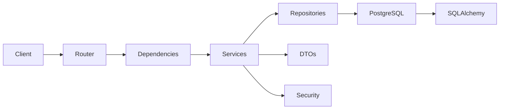

<div align="center">

# 🚀 FastAPI Production Template

### Production-Ready FastAPI Backend Template

Async FastAPI • UV • PostgreSQL • SQLAlchemy • Alembic • Docker • Nginx • GitHub Actions • VPS Deployment

[]()
[]()
[]()
[]()
[]()

</div>

## ✨ Features

| Category      | Features                          |
|---------------|-----------------------------------|
| ⚡ API         | FastAPI, Async Architecture       |
| 🗄️ Database  | PostgreSQL, SQLAlchemy, Alembic   |
| 🔐 Security   | JWT Auth, Argon2 Password Hashing |
| 🧪 Testing    | Pytest, Faker, Coverage           |
| 🐳 Containers | Docker, Docker Compose            |
| 🚀 Deployment | Nginx, Gunicorn, VPS              |
| 🔄 Automation | GitHub Actions CI/CD              |
| 🧹 Quality    | Ruff, Black, Pyrefly              |

## 🏗️ Architecture



## 📁 Project Structure

```text
app/
├── api/
├── core/
├── dtos/
├── repositories/
├── services/
├── models/
├── mappers/
└── dependencies/

tests/
├── fixtures/
├── factories/
└── ...
```

---

## 🚀 CI/CD Pipeline

```text
Push → GitHub Actions
      ↓
 Run Tests
      ↓
 Build Docker Image
      ↓
 Push to Docker Hub
      ↓
 SSH to VPS
      ↓
 Restart Service
```

---

An async FastAPI backend that demonstrates a small social-media API: users can register, authenticate, create posts,
browse feeds, and like or unlike posts.

This is an educational, production-shaped template rather than a finished product. It includes the application layers,
PostgreSQL integration, tests, Docker Compose, Alembic, and a GitHub Actions deployment workflow so you can study how
the pieces work together and replace the example domain rules with your own implementation.

## What is included

- FastAPI with async SQLAlchemy and PostgreSQL via `asyncpg`
- Pydantic v2 request and response DTOs
- Argon2 password hashing and JWT bearer authentication
- User, post, and post-like CRUD/business flows
- Repository and service layers with a post response projection query
- Pytest, async fixtures, Faker factories, coverage, Ruff, Black, and Pyrefly configuration
- Alembic migration configuration and an initial schema revision
- Development and production Docker Compose files
- Gunicorn/Uvicorn and Nginx deployment examples
- GitHub Actions build, test, image-publish, and SSH deployment workflow

The example is intentionally small. Review the implementation before using it in a real application: secrets in
development Compose are placeholders, startup currently calls `create_all()`, and the deployment manifests require
environment- and machine-specific adjustments.

## Requirements

- Python `3.14` (the project requires `>=3.14,<3.15`)
- `uv`
- PostgreSQL, either locally or through Docker Compose
- Docker Desktop, if using the container workflow
- OpenSSL, if generating a secret key from the command line

Install `uv` on Windows PowerShell:

```powershell
powershell -ExecutionPolicy ByPass -c "irm https://astral.sh/uv/install.ps1 | iex"
```

See the [uv installation guide](https://docs.astral.sh/uv/getting-started/installation/)
and [uv features](https://docs.astral.sh/uv/getting-started/features/) for other platforms.

The repository is already initialized. You normally do not need to run `uv init`, `uv add`, or `alembic init` again. For
reference, those commands are:

```powershell
uv python list
uv python install 3.14
uv init
uv add <dependency>
uv add alembic
alembic init -t pyproject_async alembic
```

## Configure the environment

Copy `.env.example` to `.env` and provide values for the settings in `app/core/config.py`:

```powershell
Copy-Item .env.example .env
```

The required settings are `APP_NAME`, `APP_VERSION`, `DEBUG`, `API_V1_PREFIX`, PostgreSQL connection fields, `TEST_DB`,
`SECRET_KEY`, `ALGORITHM`, and `ACCESS_TOKEN_EXPIRE_MINUTES`. `TEST_DB` must already exist before running the tests; the
test fixtures create and drop tables, but do not create the database itself.

Generate a key with:

```powershell
openssl rand -hex 32
```

Keep `.env` and real deployment secrets out of source control. The development Compose file contains sample credentials
for local learning only; replace them before sharing or deploying it.

## Install and run locally

Sync the locked environment:

```powershell
uv sync
uv pip freeze
```

Start the development server from the repository root:

```powershell
fastapi dev 
or
uv run fastapi dev app/main.py --host 0.0.0.0 --port 8000
```

The API is available at `http://localhost:8000`. FastAPI exposes interactive documentation at `/docs` and `/redoc`; the
health endpoint is `/health`.

## API surface

The default prefix is `/api/v1`, controlled by `API_V1_PREFIX`. All API routes except `/health` require a bearer token.

| Area   | Routes                                                                                                                                                                                                         |
|--------|----------------------------------------------------------------------------------------------------------------------------------------------------------------------------------------------------------------|
| Auth   | `POST /api/v1/auth/register`, `POST /api/v1/auth/login`, `GET /api/v1/auth/me`                                                                                                                                 |
| Users  | `GET /api/v1/users`, `GET /api/v1/users/{user_id}`, `PATCH /api/v1/users/{user_id}`, `DELETE /api/v1/users/{user_id}`                                                                                          |
| Posts  | `POST /api/v1/posts`, `GET /api/v1/posts`, `GET /api/v1/posts/users/{author_id}`, `GET /api/v1/posts/public`, `GET /api/v1/posts/{post_id}`, `PATCH /api/v1/posts/{post_id}`, `DELETE /api/v1/posts/{post_id}` |
| Likes  | `POST /api/v1/likes/{post_id}/like` toggles a like or unlike                                                                                                                                                   |
| Health | `GET /health`                                                                                                                                                                                                  |

Login uses OAuth2 form fields named `username` and `password`; the username is the user email. Send the returned token
as `Authorization: Bearer <token>`.

Quick health check from a browser console:

```javascript
fetch("http://localhost:8000/health").then((response) => response.json()).then(console.log)
```

The configured CORS allowlist is in `app/main.py`. Add the origin of your frontend there when developing across
different origins.

## Architecture and request flow

```text
Router -> dependency injection -> service -> repository -> SQLAlchemy model/PostgreSQL
  |             |                  |             |
  |             |                  |             +-- async queries and transactions
  |             |                  +-- business rules and DTO/model conversion
  |             +-- database session and current-user JWT dependency
  +-- HTTP validation and response DTOs
```

- `app/main.py` creates the application, registers CORS, exception handling, routers, and `/health`. Its lifespan
  currently calls `app/core/db_init.py:create_tables`.
- `app/api/v1/` owns HTTP routes and should stay thin.
- `app/dependancies/` contains reusable FastAPI dependencies. The directory name is intentionally `dependancies` to
  match the current project.
- `app/dtos/` contains Pydantic request/response contracts. Response DTOs exclude sensitive fields such as passwords.
- `app/services/` owns business rules, authorization checks, password hashing, and orchestration.
- `app/repositories/` owns async SQLAlchemy data access and repository transaction boundaries.
- `app/models/` contains the `User`, `Post`, and composite-key `PostLike` ORM models. `app/models/models.py` imports
  them for metadata discovery.
- `app/mappers/` converts post projection results into `PostResponse` DTOs.
- `app/core/` contains settings, database setup, security, exceptions, logging, and the declarative base.

Post reads use one projection query to return the post, author, total like count, and viewer-specific `is_liked` state.
Extend that query when adding feed metadata rather than adding per-row queries in a router.

## Database and Alembic

The application uses an async SQLAlchemy engine and `AsyncSession`. Repositories commit successful writes and roll back
database errors. The initial Alembic revision creates `users`, `posts`, and `post_likes`; PostgreSQL must provide
`gen_random_uuid()`.

For schema changes, edit the models, make sure all models are imported by `alembic/env.py`, generate a migration,
inspect it, and apply it:

```powershell
uv run alembic --help
uv run alembic revision -m "describe the change"
uv run alembic revision --autogenerate -m "describe the change"
uv run alembic current
uv run alembic heads
uv run alembic history
uv run alembic upgrade head
uv run alembic upgrade <revision>
uv run alembic downgrade -1
uv run alembic downgrade <revision>
```

Do not treat autogeneration as a substitute for reviewing a migration. The current development lifespan also runs
`Base.metadata.create_all()`, which is convenient for a fresh learning database but does not replace versioned
migrations. Before production use, choose and document one startup/migration strategy.

## Tests and quality checks

Tests live in `tests/`, use `httpx.AsyncClient` with `ASGITransport`, and reset a PostgreSQL schema for isolation. Run
them after PostgreSQL is available and `TEST_DB` exists:

```powershell
uv run pytest
pytest
pytest -x
pytest -v
pytest tests/posts/test_posts.py
pytest --cov=app --cov-report=term-missing
pytest --cov=app --cov-report=html
pytest --cov=app --cov-fail-under=90
```

The project also configures:

```powershell
uv run ruff check .
uv run ruff format --check .
uv run black --check .
uv run pyrefly check
```

Use `tests/fixtures/` for reusable setup and `tests/factories/` for generated data. Add focused tests for new
validation, authorization, persistence, and response behavior.

## Docker

You can find the perbuilt images on [Docker Hub](https://hub.docker.com/r/chamith009/fastapitemplate).

Build and inspect a local image:

```powershell
docker build -t fastapitemplate .
docker image ls
```

Tag and publish an image after authenticating with Docker Hub. Replace the repository name with your own:

```powershell
docker image tag fastapitemplate <dockerhub-user>/fastapitemplate:latest
docker push <dockerhub-user>/fastapitemplate:latest
```

Run the development stack. PostgreSQL is exposed on `5432` and the API on `8000`; the API waits for the database health
check:

```powershell
docker compose -f docker-compose-dev.yml build
docker compose -f docker-compose-dev.yml up --build
docker compose -f docker-compose-dev.yml ps
docker compose -f docker-compose-dev.yml logs -f
docker compose -f docker-compose-dev.yml down
```

Remove the local database volume as well when you intentionally want a clean database:

```powershell
docker compose -f docker-compose-dev.yml down -v
docker volume prune -f
```

Enter the running API container (the generated name may vary):

```powershell
docker compose -f docker-compose-dev.yml exec api bash
```

The production file expects its settings from `.env` and currently references `chamith009/social_media_app`. Align that
image with the image published by CI before deploying. Production also needs an explicit, reviewed migration step.

## CI/CD and deployment examples

`.github/workflows/build-deploy.yml` runs on pushes and pull requests targeting `main`, installs Python 3.14 with `uv`,
syncs dependencies, runs tests, builds and pushes a Docker image, then restarts a remote systemd service over SSH.
Configure the referenced GitHub environment secrets before enabling it.

`gunicorn.service` is a Linux/systemd example using four Uvicorn workers. `nginx` is an Nginx proxy example. Both
contain machine-specific paths/ports and must be adapted; in particular, inspect the Nginx upstream port before use.

## Extending the template

1. Define or update Pydantic DTOs in `app/dtos/`.
2. Add or change SQLAlchemy models in `app/models/`, import them for metadata discovery, and create/review an Alembic
   migration.
3. Put data access in a repository and business rules in a service.
4. Keep routers focused on HTTP concerns and dependency injection.
5. Reuse the current-user dependency for protected routes and enforce ownership in the service layer.
6. Add fixture/factory-backed tests before changing the deployment configuration.
7. Run tests, coverage, lint, formatting, and type checks before merging.

For the agent-facing rules and decision checklist,
see [the FastAPI backend development skill](.github/skills/fastapi-backend-template/SKILL.md). The original
architectural note remains in [skills/skills.md](skills/skills.md).

---

⭐ If this template helps you start projects faster, consider starring the repository.

Built with FastAPI, UV, PostgreSQL, Docker, and GitHub Actions.
